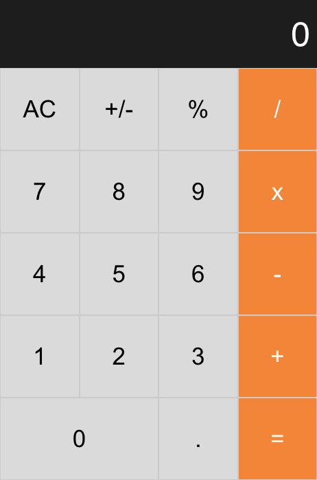

## Project Description

This is a react calculator app designed to perform basic calculation.

## Built With

 -  React / React-DOM
 -  React-Create-App
 -  JavaScript ES6 / HTML

## Getting Started Locally

### Prerequisities
To get this project up and running locally, you must have node and yarn installed on your machine.

**Step 1** 
Clone git repo

**Step 2** 
Next, run `cd react-calculator`. 

**Step 3** 
Run `yarn start` to begin the server. 

**Step 4** 
Navigate to `http://localhost:3000/` in a browser. 

### Testing
This project uses Jest for testing.
> To run tests open a terminal inside the project's root directory and enter `yarn test`
